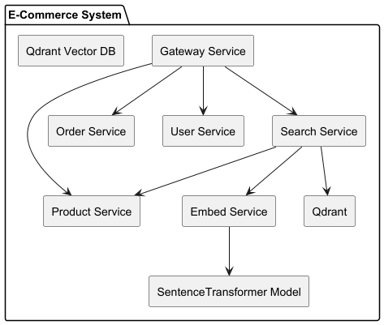

# 🛍️ E-Commerce Microservices Platform


This is a microservices-based e-commerce backend system built using **Java (Spring Boot)**, **Python**, **Docker**, and **Qdrant** (for vector search). A central **API Gateway** handles all incoming traffic and routes to specific services.

---

## 🚀 Services Overview

| Service           | Description                                                                 |
|-------------------|-----------------------------------------------------------------------------|
| `gateway-service` | Routes API requests to respective microservices. Runs on `8080`.            |
| `product-service` | Manages products (CRUD). Exposed internally at `8081`.                      |
| `order-service`   | Handles orders and order history. Exposed internally at `8082`.             |
| `user-service`    | Manages user registration, login, profiles. Exposed at `8083`.              |
| `search-service`  | Performs product search using Qdrant vector DB. Communicates with:          |
|                   | - `product-service` to fetch products                                       |
|                   | - `embed-service` to generate embeddings                                    |
|                   | - `qdrant` to store/query vector data                                       |
| `embed-service`   | A Python FastAPI service that generates vector embeddings using SentenceTransformer|
| `qdrant`          | Vector database to store & search high-dimensional embeddings.              |

---

## 📦 Tech Stack

- Java 17, Spring Boot 3
- Python 3.13 (FastAPI)
- Qdrant Vector DB
- Docker + Docker Compose
- RESTful APIs
- Microservices Architecture
- Vector Embeddings via `embed-service`
- Scheduled embedding jobs in `search-service`

---

## 🧠 How Embeddings Work

- On startup and every 5 mins, `search-service` runs a job:
  - Fetches unembedded products from `product-service`
  - Sends combined text (name, brand, description) to `embed-service`
  - Receives vector and uploads to Qdrant using `qdrantService`

## 🐳 How to Run

```bash
# Step 1: Clone the repo
git clone https://github.com/your-repo/ecommerce-platform.git
cd ecommerce-platform

# Step 2: Start all containers
docker-compose up --build
